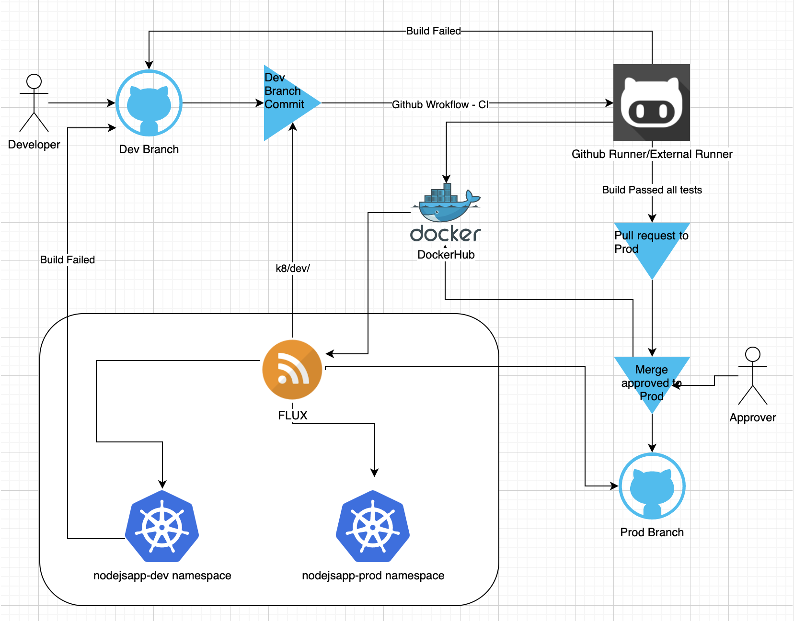

# NodeJS_on_Minikube
Sample nodejs application connecting to a db hosted on minikube and exposed as a service. 
Pipeline created in GitHub using GitHub workflows to perform the CI (1 on GitHub runners and 2 pushed to dev namespace using flux) and use CD to push the final build as canary deployment to prod namespace.

## Steps
1. Checkout a new branch from master (Prod) as dev/feature1. Do the changes and commit your code. Any changes inside the db or client folders are analysed on dev push and the GitHub workflow is triggered.
2. The workflow checks out the repository branch into the local workspace on the runner and then sets up a minikube cluster. It further uses the kustomization.yaml to deploy all the required resources on the cluster inside dev namespace.
3. Once deployed, it waits and then checks if the front page is giving a response to the request or not. If its a success, it displays the same in the workflow action and if not, then it exits with exit status as 1.
4. As an alternative, a dev namespace has been setup using the same scripts on an ec2 instance. Flux has been installed using the [script](ansible/setup_minikube/scripts/flux.sh) and the deploy keys have been added in the GitHub repository for flux to connect and deploy if there are any changes in the dev k8 manifests. The docker images are pushed using the CI workflow to dockerhub which are marked in the k8 manifests. **Note** Use the Ansible role to setup minikube along with all the dependencies followed by running the kustomization.yaml file from the k8/dev.
5. Once the test has been passed for dev on GitHub runner (this may be the GitHub runner or we may attach our own external runner to GitHub) and minikube cluster on ec2 instance, a Pull request will be created by the developer.
6. The pull request will be approved by the approver to merge to master (prod). Once this is done, the CD workflow is executed which checks the changes in the code and builds/pushes the image to DockerHub in the production repository. (The repo are marked as public for you to see)
7. Once the new images are pushed to dockerhub, kubernetes uses the imagePullPolicy as Always to pull the latest images from dockerhub and deploy in a canary manner.

## Application architecture
1. The [code](nodejs_app/) is simple and basic consisting of 2 parts - db and client. The db contains the mysql images and initiated to create a sample database as nodemysqldb with a table hello having the data to read as "Hello World".
2. The client is designed to connect to the database and print out the value from the above mentioned table.
3. The sample application is created on a basic model thus security is not considered for now. This sure, can be an improvement point.

## Deployment View

